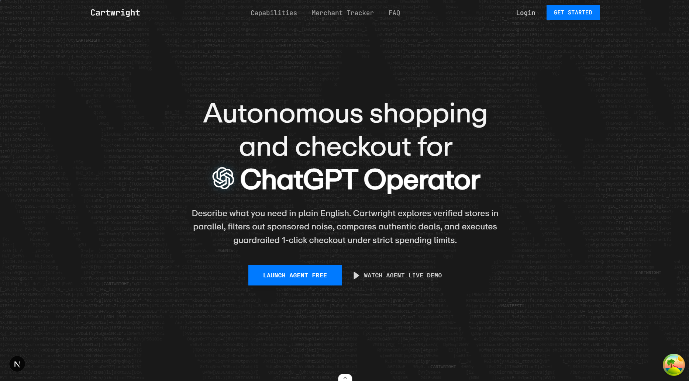

# Cartwright

**Autonomous AI shopping & merchant checkout platform.**

Describe what you need in plain English. Cartwright explores verified stores in parallel, filters out sponsored noise, compares authentic deals, and executes guardrailed 1-click checkout under strict spending limits. Merchants see every AI buyer in real time.



**Watch demo:** [https://youtu.be/Dcm_cUj0LmY](https://youtu.be/Dcm_cUj0LmY)

## What is this?

Cartwright has two sides:

**1. Shopper agent (`/shopper`)**
- Natural-language intent → autonomous browser agents with vision models
- Parallel multi-store discovery, no brittle scrapers or hardcoded selectors
- Sponsored-noise filtering + authentic 0–100 match score (specs, reviews, price history)
- Live session view: screenshots + step-by-step action log (intent → search → filter → cart verify → checkout)
- Wallet-guardrailed checkout via Razorpay (test mode simulated, never moves real money)

**2. Merchant platform (`/merchant`)**
- Drop-in **Universal Tracker** (`@cartwright/tracker` or one `<script>` tag) for Shopify, WooCommerce, BigCommerce, Wix, custom SPAs
- Dashboard: KPIs, funnel (visit → product → cart → checkout → purchase), Human vs AI-agent split, top searches, orders, geo, customers
- Merchant chat with live PostHog context injected into the system prompt
- Sites / orders / customers / sales pages backed by PostHog HogQL + Postgres

## Features

| Area | What you get |
| --- | --- |
| Universal add-to-cart | Human-like navigation: sizes, popups, cart verification on any storefront |
| Zero sponsored bias | Query-relevance gating, no affiliate ranking |
| Wallet guardrails | Per-item + per-session caps, auto-approval limit, explicit user approval above it |
| Live execution log | Intent extraction, store queries, filters, candidates, price checks |
| Merchant tracker | 13 canonical events (`cartwright_*`), auto adapter + DOM heuristic + explicit API |
| Analytics | Revenue, AOV, conversion, fulfillment, agent share, funnels, search demand, cohorts |
| Chat | `fetchPostHogContext` → KPIs + funnel + top searches + recent orders in prompt |

## Tech stack

- **Monorepo:** Turborepo + bun workspaces (`apps/*`, `packages/*`)
- **Web:** Next.js 16, React 19, TailwindCSS 4, shadcn/ui (`packages/ui`), tRPC, TanStack Query
- **Agent:** `packages/agent` — orchestration, browser vision, policy enforcement
- **Tracker SDK:** `packages/tracker` — served as `apps/web/public/tracker/v1.js`
- **API / Auth / DB:** `packages/api`, `packages/auth` (Better-Auth), `packages/db` (Drizzle + PostgreSQL)
- **Analytics:** PostHog (`posthog-js` ingest, HogQL reads)
- **Payments:** Razorpay test mode + wallet spending policy

## Project structure

```
cartwright/
├── apps/web/              # Next.js app — landing, /shopper, /merchant, /api/*
│   ├── src/app/page.tsx   # Landing page
│   ├── src/app/shopper/   # Shopper agent UI
│   ├── src/app/merchant/  # Merchant dashboard, chat, orders, customers, sites
│   └── public/tracker/v1.js # Built tracker SDK
├── packages/
│   ├── agent/             # Shopper agent logic
│   ├── tracker/           # Universal tracker SDK (canonical events + mapper)
│   ├── api/               # tRPC + PostHog readers (stats, merchant-chat)
│   ├── auth/              # Better-Auth config
│   ├── db/                # Drizzle schema & queries
│   ├── env/               # Typed env (`packages/env/src/server.ts`)
│   └── ui/                # Shared shadcn/ui primitives + globals.css
├── scripts/               # Local dev / test helpers
├── data/                  # Product catalog seed data
└── public/landing.png     # Landing page screenshot (used above)
```

## Getting started

```bash
bun install
```

### 1. Environment

Copy envs and fill in Postgres + PostHog + Razorpay keys:

```bash
# apps/web/.env — DB_URL, BETTER_AUTH_*, POSTHOG_*, RAZORPAY_*, WALLET_*
```

Key vars (see `packages/env/src/server.ts`):

```env
WALLET_BALANCE_PAISE=1000000
WALLET_CURRENCY=INR
PAYMENT_AUTO_APPROVAL_LIMIT_PAISE=150000
RAZORPAY_MODE=test
RAZORPAY_TEST_UPI_ID=success@razorpay
AGENT_RAZORPAY_ORDER_FALLBACK=false

POSTHOG_HOST=https://us.i.posthog.com
POSTHOG_PERSONAL_API_KEY=phx_...
POSTHOG_PROJECT_ID=362639
POSTHOG_PROJECT_WRITE_KEY=phc_...
POSTHOG_INGESTION_HOST=https://us.i.posthog.com
```

### 2. Database (PostgreSQL + Drizzle)

```bash
bun run db:push     # apply schema
bun run db:studio   # inspect (optional)
```

### 3. Run

```bash
bun run dev         # all apps (web on http://localhost:3001)
# or
bun run dev:web     # web only
```

## Agent payment policy

The shopper uses a wallet-style spending policy around the merchant's own checkout. It is a limit and audit boundary, not a bank account or Razorpay balance.

In Test Mode, payments at or below the auto-approval limit may open the merchant's visible payment control automatically. Payments above the limit require user approval. Live Mode always requires user approval. Cartwright does not create a second payment order for a black-box merchant; the merchant must create its own Razorpay order, verify the signature, capture the payment, and process webhooks. Razorpay Test Mode is simulated and never moves real money.

### Merchant payment contract

The shopper only treats a payment as merchant-connected when the rendered merchant checkout exposes a **visible payment control**. The agent then retains that checkout session, applies the wallet policy, and either opens the control automatically for an eligible Test Mode payment or waits for user approval. A page that merely loads `checkout.js` is not a payment integration and stops without creating an order.

`AGENT_RAZORPAY_ORDER_FALLBACK=true` enables the service-mediated adapter for a merchant with no visible payment UI. It creates a Razorpay Test order with the configured test account and labels the audit trail accordingly — not evidence the merchant site created the order.

## Merchant tracker — install

```html
<script
  src="https://your-domain/tracker/v1.js"
  data-posthog-key="phc_..."
  data-posthog-host="https://us.i.posthog.com"
></script>
```

Or via package: `@cartwright/tracker`. Emits 13 `cartwright_*` events (page_viewed → search → product → cart → checkout → purchase/failed) with `merchant_id`, `site_id`, `actor_type` (`shopper|agent`), cart/order snapshots, and agent telemetry. Server reads via HogQL in `packages/api/src/posthog/client.ts`.

## Scripts

- `bun run dev` / `bun run build` / `bun run check-types`
- `bun run db:push` / `db:generate` / `db:migrate` / `db:studio`
- `bun run docker:build` / `docker:up` / `docker:logs` / `docker:down`

See `docs/system-architecture.md` for the full data flow.
