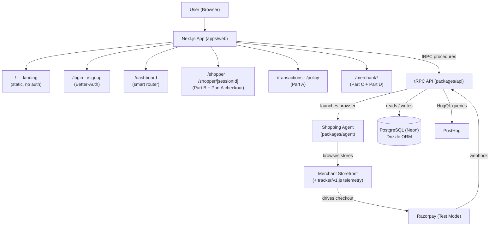
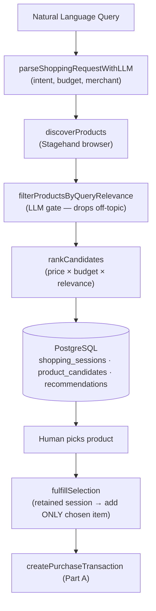
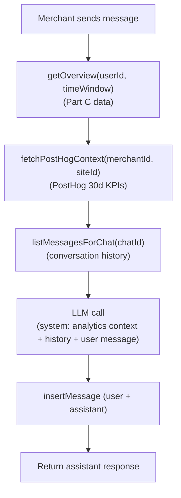
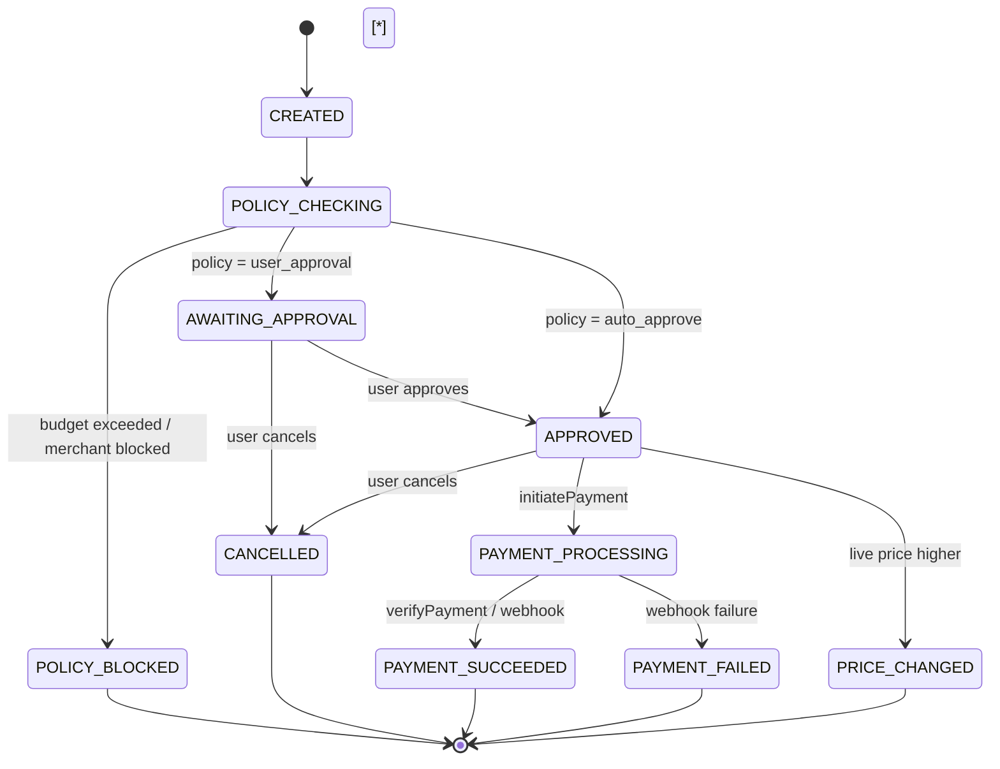
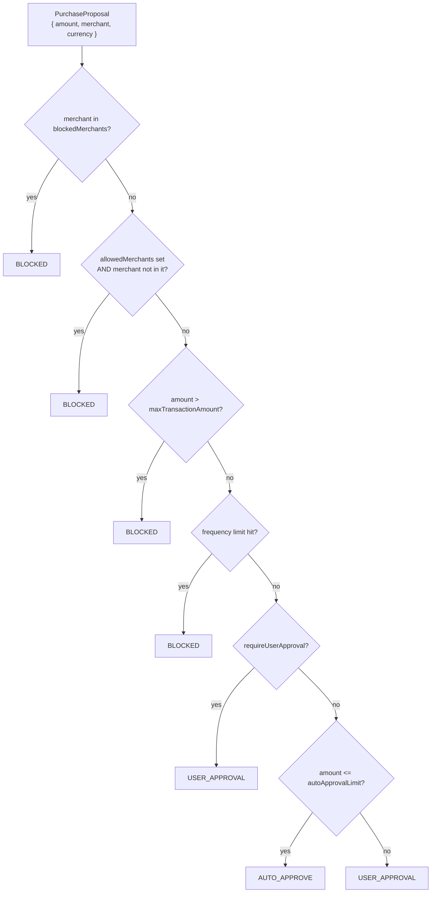
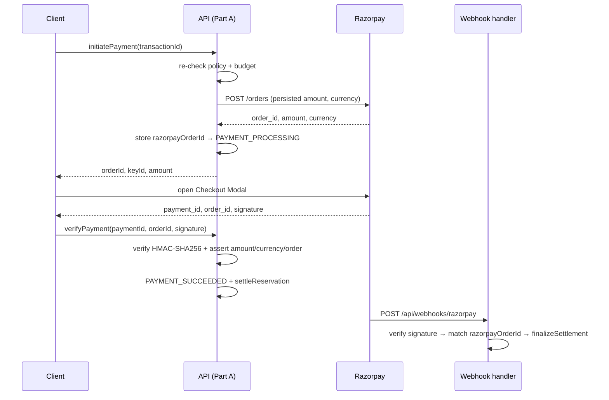
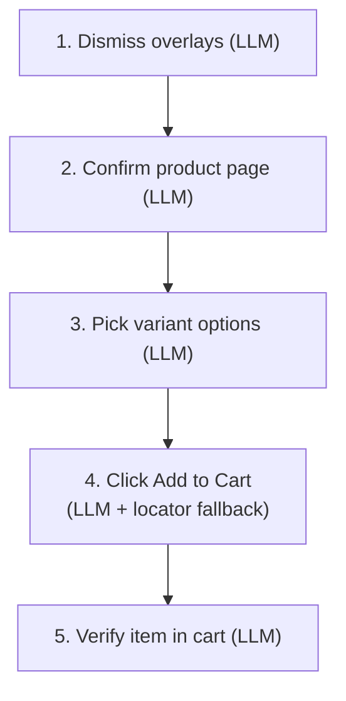
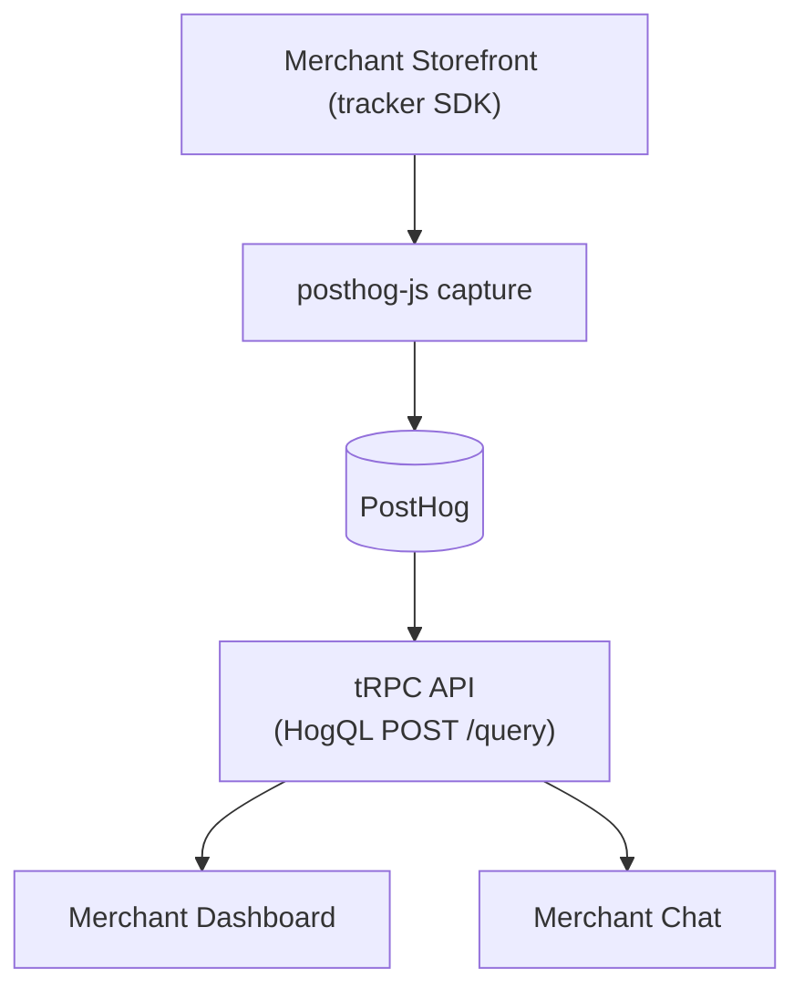

# Cartwright System Architecture — Full Website

> Autonomous AI shopping + merchant checkout platform. Next.js + tRPC + Drizzle/PostgreSQL + PostHog + Razorpay (Test Mode).

---

## Table of Contents

1. [Overview](#1-overview)
2. [High-Level Architecture](#2-high-level-architecture)
3. [Website Map — every route & section](#3-website-map--every-route--section)
4. [System Parts](#4-system-parts)
5. [Monorepo Package Map](#5-monorepo-package-map)
6. [Database Schema](#6-database-schema)
7. [Transaction State Machine](#7-transaction-state-machine)
8. [Payment Policy Engine](#8-payment-policy-engine)
9. [Razorpay Integration](#9-razorpay-integration)
10. [Shopping Agent Deep-Dive](#10-shopping-agent-deep-dive)
11. [Analytics & PostHog Integration](#11-analytics--posthog-integration)
12. [Authentication](#12-authentication)
13. [Environment Variables Reference](#13-environment-variables-reference)
14. [Available Scripts](#14-available-scripts)
15. [Deployment](#15-deployment)

---

## 1. Overview

**Cartwright** is an agentic commerce platform where a browser-automation AI agent:

- Searches merchant storefronts on a user's behalf using natural language
- Surfaces ranked product candidates and lets the human pick
- Enforces a configurable **wallet spending policy** before any payment
- Completes a Razorpay checkout (Test Mode) end-to-end — card or wallet
- Gives the merchant a **real-time analytics dashboard** and an AI chat to query their data

The system is split into four clearly-separated parts so that concerns (money, browsing, analytics, conversation) never bleed across boundaries:

| Part | Description |
|---|---|
| **A** | Transaction lifecycle + payment gate (the single source of truth for money) |
| **B** | Shopping agent session — discovery, selection, browser automation |
| **C** | Merchant intelligence — read-only analytics derived from Parts A & B state |
| **D** | Merchant chat — multi-turn LLM assistant that answers questions about Part C data |

> **Important:** Part C and D are read-only with respect to money. They never create a transaction, never mutate payment status, and never bypass the amount-authority or policy-gate that lives in Part A.

---

## 2. High-Level Architecture



---

## 3. Website Map — every route & section

All pages live under `apps/web/src/app`. Auth-gated pages check `auth.api.getSession()` per request (`export const instant = false`) and redirect to `/login`.

### 3.1 Landing — `/` (`app/page.tsx`)

Public, no auth. Composition:

| Section | Component | Content |
|---|---|---|
| Navbar | `landing/navbar.tsx` | Links: Capabilities (`#capabilities`), Merchant Tracker (`#merchant-tracker`), FAQ (`#faq`) + Launch CTA + login |
| Hero | `landing/hero-section.tsx` | "Autonomous shopping and checkout for AI agents", sub-copy, `Launch Agent Free` → `#features`, `Watch agent live demo` modal (`/logos/videos/plan-every-change.webm`), ASCII canvas backdrop |
| Trust banner | `landing/trust-banner.tsx` | Customer proof + protocol strip |
| Value props | `landing/value-props.tsx` | 3 cards: Universal LLM Add-To-Cart / Zero Sponsored Bias / Wallet Guardrails & Merchant Tracker |
| Features | `landing/features-section.tsx` | Wallet spending policy (`policy.json` code block) + real-time agent execution log + tracker architecture |
| FAQ | `landing/faq.tsx` | 7 accordions: discovery, budget security, sponsored bias, live watch, OOS/overprice, merchant install, pricing (free) |
| CTA | `landing/cta.tsx` | Final launch call-to-action |
| Footer | `landing/footer.tsx` | Full sitemap / legal footer |

### 3.2 Auth — `/login`, `/signup`

Better-Auth email/password (+ OAuth where configured). Establishes `user / session / account / verification` rows. Every route below depends on this session; `userId` is always server-derived, never client-supplied.

### 3.3 Smart router — `/dashboard` (`app/dashboard/page.tsx`)

Client page. Loads `merchantIntelligence.getAccount` + `transactions.list`:
- Has transactions → `ShopperTab` (shopping activity, transactions, spending policy summary)
- No transactions but has merchant account → pushes to `/merchant/dashboard`
- No session → pushes to `/login`

### 3.4 Shopper — `/shopper`, `/shopper/[sessionId]`

The Part B + Part A front-end (`shopper-client.tsx`, `session-web-preview`, `shopper/recommendation-card`, `shopper/transaction-panel`, `approval-card`).

Flow:
1. Natural-language query → `parseShoppingRequestWithLLM` (intent, budget, merchant)
2. `runShoppingAgent` (discovery only: `checkout: false, retainSession: true`) → candidates stored in `shopping_sessions / product_candidates / recommendations`
3. `filterProductsByQueryRelevance` drops sponsored/off-topic → `rankCandidates`
4. Human picks one → `fulfillSelection` (retained session navigates to chosen URL, adds **only** that item)
5. `getSessionCheckoutTotal` re-reads live total → `createPurchaseTransaction` (Part A)
6. Policy gate → `AWAITING_APPROVAL` card or auto-approve → Razorpay modal (`window.Razorpay`) → `verifyPayment` → confirmation capture
7. Live view: browser screenshots, step log, video recording (`packages/agent/recordings/session-*.mp4`), local/browserbase toggle (`?browser=` persisted in sessionStorage)

### 3.5 Transactions — `/transactions`

`transactions-list.tsx`. Auth-gated ledger over Part A: every transaction with status (`CREATED → POLICY_CHECKING → APPROVED / AWAITING_APPROVAL / POLICY_BLOCKED → PAYMENT_PROCESSING → PAYMENT_SUCCEEDED / PAYMENT_FAILED / CANCELLED / PRICE_CHANGED`), amounts in minor units, Razorpay order/payment ids, audit trail link.

### 3.6 Spending policy — `/policy`

`policy-settings.tsx`. Edits `payment_policies` per user: max per-transaction, max total spend (`consumedInMinor` budget), currency, `requireUserApproval`, allowed/blocked merchants. Falls back to env defaults (`WALLET_BALANCE_PAISE=1000000`, `PAYMENT_AUTO_APPROVAL_LIMIT_PAISE=150000`). This is the UI for the §8 policy engine.

### 3.7 Merchant — `/merchant/*`

All merchant pages share `useMerchantContext` (account, `merchantId`, `siteId` selector, primary site) + `useTrackerStats` (cached `GET /api/tracker/stats` → 8 parallel HogQL queries). `/merchant` alone redirects to `/merchant/dashboard`.

| Route | File | Sections |
|---|---|---|
| `/merchant/dashboard` | `merchant/dashboard/page.tsx` → `dashboard/merchant-tab` | Storefront overview: KPIs (orders, revenue, AOV, agent share, conversion), 5-step funnel (page→product→cart→checkout→purchase), daily Human vs AI series, top searches + missed revenue, recent orders |
| `/merchant/orders` | `merchant/orders/page.tsx` | KPI grid (total orders, gross revenue, AOV, AI volume, fulfillment), `BarChartStacked` time series + Human-vs-AI radar, searchable/filterable Past Orders table (status, fulfillment, progress, payment, copyable order id, pagination) |
| `/merchant/customers` | `merchant/customers/page.tsx` | 6 KPIs (total/active/1st-time/repeat/CLV/new), `CustomerGrowthChart` + `IndiaMapChart` geo hubs, Customer Directory table (Human/AI badge, spend, expandable detail, search + type filter) |
| `/merchant/sales` | `merchant/sales/page.tsx` | KPIs (gross revenue, orders, AOV, AI orders, settlement rate), revenue-trend stacked chart + Payment & Channel Efficiency radar, Catalog Sales table (units, gross, revenue share bar, ASP, expandable detail) |
| `/merchant/sites` | `merchant/sites/page.tsx` | KPI cards (merchant id, primary site id, storefront count), Registered Storefronts table (name, site id, platform badge, primary/secondary role), Register dialog (name + platform: normal/shopify/woocommerce/magento/bigcommerce/wix/custom_spa/other), per-site `<script data-site data-platform data-merchant>` copy button, set-primary / remove |
| `/merchant/chat`, `/merchant/chat/[chatId]` | `merchant/chat/page.tsx`, `[chatId]/page.tsx` → `chat-client.tsx` | Part D assistant: `getOverview` (Part C) + `fetchPostHogContext` (30d KPIs/funnel/searches/orders) + history → chat-completions; multi-chat list, message persistence (`insertMessage`) |

---

## 4. System Parts

### Part A — Payment & Transaction Engine

**Location:** `packages/api/src/transactions/` + `packages/api/src/payments/`

This is the **only authority** that creates, moves, and settles money-related state. Every other subsystem reads or delegates to Part A, never bypasses it.

#### What it does

| Responsibility | Detail |
|---|---|
| **Transaction CRUD** | Insert, read, list, update transactions with typed state enum |
| **Policy evaluation** | `evaluateUserPaymentPolicy` — the single decision point for `auto_approve / user_approval / blocked` |
| **Spending reservation** | Atomically increments `consumedInMinor` (row-locked UPDATE … SET consumed = consumed + amount WHERE consumed + amount <= max) |
| **Razorpay order** | Creates a server-side Razorpay order from the *persisted* amount (never the client's) |
| **Signature verification** | Re-checks Razorpay payment + order against the persisted row |
| **Webhook handling** | Signature-verified inbound Razorpay webhook → settle or fail reservation |
| **Audit trail** | Every lifecycle step writes an append-only `audit_events` row |
| **Idempotency** | Keyed on `(userId, idempotencyKey)`, `razorpayOrderId`, `razorpayPaymentId` |

#### Safety guardrails

- Razorpay only used when `RAZORPAY_MODE === "test"` **and** key starts with `rzp_test_`
- Charged amount is **server-derived** (`deriveAmount`) and re-validated at initiate/verify — the AI/client never sets the final amount
- Ownership enforced on every read/write — a user can only touch their own transaction
- `metadata` in audit events carries no card data or secrets
- Live mode forces `user_approval` and never auto-charges

---

### Part B — Shopping Agent & Session Orchestration

**Location:** `packages/api/src/shopping/` + `packages/agent/`

Part B drives the browser automation and product-discovery pipeline. It never creates a payment itself — it hands off to `createPurchaseTransaction` (Part A) only after explicit human selection.

#### Discovery pipeline (add-to-cart-free)



#### Key rules

| Rule | Enforcement |
|---|---|
| Discovery never adds to cart | `runShoppingAgent` called with `checkout: false, retainSession: true` |
| Only chosen item is added | `fulfillSelection` navigates to selected product URL and adds only that |
| Query-relevance gate | LLM drops sponsored / upsell / off-topic candidates before they reach the human |
| Amount is re-read after add | `getSessionCheckoutTotal` re-reads the live checkout total post-add so the charged amount is exact |

---

### Part C — Merchant Intelligence & Analytics

**Location:** `packages/api/src/merchant-intelligence/`

Read-only analytics derived from Parts A & B data. Scoped to the authenticated user's own data (`userId` — never accepted from the client).

#### Commerce Funnel

The funnel maps 1:1 to persisted state:

| Stage | Source table | Counting rule |
|---|---|---|
| `sessionsTotal` | `shopping_sessions` | all sessions in window |
| `discovered` | `product_candidates` | rows where `rejected = false` |
| `recommended` | `recommendations` | row count in window |
| `selected` | `shopping_sessions.status` | `status IN (selected, converted)` |
| `purchaseRequested` | `shopping_sessions.status` | `status = converted` (transactionId set) |
| `approved` | `transactions.status` | `status IN (APPROVED, PAYMENT_PROCESSING, PAYMENT_SUCCEEDED, PAYMENT_FAILED)` |
| `paymentSucceeded` | `transactions.status` | `status = PAYMENT_SUCCEEDED` |
| `policyBlocked` | `transactions.status` | `status = POLICY_BLOCKED` |
| `cancelled` | `transactions.status` | `status = CANCELLED` |

#### Derived Metrics

```
discoveryToRecommendationRate   = recommended / discovered
recommendationToSelectionRate   = selected / recommended
selectionToPurchaseRate         = purchaseRequested / selected
purchaseToApprovalRate          = approved / purchaseRequested
approvalToPaymentRate           = paymentSucceeded / approved
overallConversionRate           = paymentSucceeded / purchaseRequested
```

#### Structured Insights

Every insight traces back to a real computed metric — no free-text "AI advice" is ever injected. Insight types:

| Type | Description |
|---|---|
| `underperforming_recommendation` | A recommended product has a low selection rate |
| `selection_purchase_dropoff` | Many sessions are left stranded mid-selection |
| `rank_position_selection_gap` | Lower-ranked recommendations outperform top ones |

---

### Part D — Merchant Chat (AI Conversational Layer)

**Location:** `packages/api/src/merchant-chat/`

Multi-turn LLM assistant for merchants. Uses the same `AGENT_LLM_*` endpoint as the shopping agent, but drives a standard chat-completions flow (no browser, no Stagehand).

#### How it works



The system prompt is built from:
1. **Funnel metrics + product performance** (Part C)
2. **Live PostHog analytics** (KPIs, top searches, recent orders — last 30 days)
3. **Full conversation history** from the database

---

## 5. Monorepo Package Map

```
cartwright/
├── apps/
│   └── web/                    # Next.js fullstack app (App Router)
│       └── src/
│           ├── app/
│           │   ├── page.tsx            # Landing (navbar/hero/trust/props/features/faq/cta/footer)
│           │   ├── login/ signup/      # Better-Auth entry
│           │   ├── dashboard/          # Smart router (shopper ⇄ merchant)
│           │   ├── shopper/            # Shopper agent UI (+ [sessionId])
│           │   ├── transactions/       # Part A ledger
│           │   ├── policy/             # Spending guardrails UI
│           │   └── merchant/           # Part C + D
│           │       ├── dashboard/      # Overview KPIs + funnel
│           │       ├── orders/         # Orders + agent radar
│           │       ├── customers/      # Customers + growth + India map
│           │       ├── sales/          # Catalog sales + channel radar
│           │       ├── sites/          # Storefront registry + script tags
│           │       └── chat/           # Part D assistant (+ [chatId])
│           └── lib/            # Client-side helpers + tRPC client
│
├── packages/
│   ├── agent/                  # Browser automation (Stagehand + Playwright)
│   │   └── src/
│   │       ├── shopping-agent.ts       # Core orchestrator
│   │       ├── add-to-cart.ts          # LLM-driven add-to-cart
│   │       ├── filtering/              # Query-relevance LLM gate
│   │       ├── merchants/              # Pluggable merchant profiles
│   │       └── store-presets.ts        # Known storefront shortcuts
│   │
│   ├── api/                    # tRPC server + all backend logic
│   │   └── src/
│   │       ├── routers/                # tRPC procedure definitions
│   │       ├── transactions/           # Part A — state machine + service
│   │       ├── payments/               # Part A — policy, approval, Razorpay
│   │       ├── shopping/               # Part B — session orchestration
│   │       ├── merchant-intelligence/  # Part C — analytics
│   │       ├── merchant-chat/          # Part D — LLM chat
│   │       ├── audit/                  # Audit trail service
│   │       └── posthog/                # HogQL query client
│   │
│   ├── db/                     # Drizzle ORM schema + repositories
│   │   └── src/
│   │       ├── schema/                 # pgTable definitions
│   │       ├── repositories/           # One file per aggregate
│   │       └── migrations/             # drizzle-kit SQL migrations
│   │
│   ├── auth/                   # Better-Auth configuration
│   ├── env/                    # Typed env schema (server + client)
│   ├── tracker/                # Browser-side analytics tracker SDK
│   └── ui/                     # Shared shadcn/ui component library
```

---

## 6. Database Schema

All amounts are **integer minor units** (e.g. paise for INR). Never floats for money.

### Tables

| Table | Purpose | Key columns |
|---|---|---|
| `user` | Core identity | `email` (unique), `name` |
| `session` | Active sessions | `token` (unique), `userId`, `expiresAt` |
| `account` | OAuth provider links | `userId`, `provider` |
| `verification` | Email verification tokens | `identifier`, `value` |
| `transactions` | Canonical purchase record | `amountInMinor` (server-authoritative), `currency`, `razorpayOrderId` (unique), `razorpayPaymentId` (unique), `idempotencyKey`, `status` (pgEnum), `expiresAt` |
| `payment_policies` | Per-user spending policy | `maxTransactionAmount`, `maxTotalSpending`, `currency`, `requireUserApproval`, `allowedMerchants`/`blockedMerchants` (text[]), `consumedInMinor` |
| `spending_reservations` | Durable spending hold per transaction | `amountInMinor`, `currency`, `status` (RESERVED / SETTLED / RELEASED) |
| `audit_events` | Append-only event log | `eventType` (pgEnum), `transactionId` (nullable), `userId` (nullable), `reason`, `metadata` (jsonb — no secrets) |
| `shopping_sessions` | Discovery session per request | `query`, `merchant`, `status`, `transactionId`, `idempotencyKey`, `expiresAt` |
| `product_candidates` | Discovered products per session | `title`, `merchant`, `amountInMinor`, `currency`, `rejected` |
| `recommendations` | Ranked subset of candidates | `productCandidateId`, `rank` |
| `browser_sessions` | Retained browser session tracking | `browserbaseSessionId`, `status` |

### Budget invariants

`consumedInMinor` on `payment_policies` is the only moving piece:

| Operation | Function | Guard |
|---|---|---|
| Reserve | `incrementConsumed(userId, amount)` | `consumed + amount <= maxTotalSpending` — returns `undefined` on exceed |
| Release (cancel/block) | `decrementConsumed(userId, amount)` | `GREATEST(0, consumed - amount)` |
| Settle (payment captured) | `settleReservation` | Moves reservation to `SETTLED` |

---

## 7. Transaction State Machine



State transitions are enforced by a `VALID_TRANSITIONS` table in `transaction.state.ts`. String literals **never** move a row between states directly — every transition goes through `assertTransition`.

---

## 8. Payment Policy Engine

**File:** `packages/api/src/payments/payment-policy.service.ts`

The single authority for deciding whether a proposed purchase may proceed. Always **returns** a decision (never throws), so a `blocked` outcome can be persisted as `POLICY_BLOCKED` + an audit row.

### Decision flow



### Default policy (from env when no DB row exists)

| Variable | Default | Value |
|---|---|---|
| `WALLET_BALANCE_PAISE` | Total budget | `1000000` (₹10,000) |
| `WALLET_CURRENCY` | Currency | `INR` |
| `PAYMENT_AUTO_APPROVAL_LIMIT_PAISE` | Auto-approve cap | `150000` (₹1,500) |

---

## 9. Razorpay Integration

Cartwright integrates with Razorpay **Test Mode only**. Live mode is gated behind `user_approval` and never auto-charges.

### Server-side flow



### Safety rules

- `isTestModeSafe()` — returns `false` if `RAZORPAY_MODE !== "test"` or key doesn't start with `rzp_test_`
- Verify/webhook both compare Razorpay-reported amount/currency/order against the persisted row, never the client's claim
- `AGENT_RAZORPAY_ORDER_FALLBACK=true` enables a service-mediated adapter for merchants without a visible payment UI (labels the audit trail accordingly)

---

## 10. Shopping Agent Deep-Dive

**Package:** `packages/agent/`
Built on **Stagehand** (`@browserbasehq/stagehand`) + Playwright, using `openai/gpt-oss-20b` via NVIDIA's OpenAI-compatible endpoint.

### Core capabilities

| Capability | How it works |
|---|---|
| **Product discovery** | `runShoppingAgent` with `checkout: false, retainSession: true` — browses the store, lists candidates, retains the session |
| **Query-relevance gate** | `filterProductsByQueryRelevance` — LLM drops sponsored/off-topic listings before they reach the human |
| **LLM-driven add-to-cart** | `llmAddToCart` — no per-site regex. Works on Nike, Amazon, local merchants. Dismiss overlays → confirm product page → pick options → click Add to Cart → verify cart |
| **Human-in-the-loop add** | `fulfillSelection(sessionId, productUrl)` — navigates retained session to chosen URL, adds **only** that item |
| **Checkout navigation** | Proceeds to checkout, reads the live total |
| **Payment-gate detection** | Identifies Razorpay or generic payment UI from rendered DOM only (no merchant secrets) |
| **Razorpay card automation** | `completeRazorpayTestPayment` — fills test card, "Continue", dismisses RBI save-card dialog, clicks Success in mock bank window |
| **Razorpay wallet automation** | `completeRazorpayTestWalletPayment` — selects Wallet tab, picks wallet (olamoney/mobikwik/airtelmoney), handles OTP if needed, clicks Success |
| **Order confirmation capture** | Reads merchant's confirmation page (URL, title, order ID, amount, status) |
| **Session recording** | Always-on video via Playwright CDP screencast → ffmpeg-static MP4 transcode |

### LLM-driven add-to-cart (no hard-coded selectors)



Works on every provider — Nike, Amazon, local/demo merchants — without any per-site regex or hard-coded navigation.

### Merchant profiles (pluggable)

Each merchant is a pure-data profile registered via `registerLocalMerchant`. The generic engine (`src/local-merchant.ts`) handles the rest. Add a new merchant with a new profile file — no core changes needed.

### Session recording output

```
packages/agent/recordings/session-<YYYY-MM-DD_HH-mm-ss>.mp4
```

---

## 11. Analytics & PostHog Integration

**Tracker package:** `packages/tracker/`
**Server query client:** `packages/api/src/posthog/client.ts`

### Data flow



### 13 canonical events

| # | PostHog event | Canonical name |
|---|---|---|
| 1 | `cartwright_page_viewed` | `page_viewed` |
| 2 | `cartwright_search_performed` | `search_performed` |
| 3 | `cartwright_product_list_viewed` | `product_list_viewed` |
| 4 | `cartwright_product_selected` | `product_selected` |
| 5 | `cartwright_product_viewed` | `product_viewed` |
| 6 | `cartwright_agent_action` | `agent_action` |
| 7 | `cartwright_add_to_cart` | `add_to_cart` |
| 8 | `cartwright_remove_from_cart` | `remove_from_cart` |
| 9 | `cartwright_cart_viewed` | `cart_viewed` |
| 10 | `cartwright_checkout_started` | `checkout_started` |
| 11 | `cartwright_payment_started` | `payment_started` |
| 12 | `cartwright_purchase_completed` | `purchase_completed` |
| 13 | `cartwright_purchase_failed` | `purchase_failed` |

### Stats API (`GET /api/tracker/stats`)

Runs **8 parallel HogQL queries** scoped by merchant + site + time range:

1. Purchase KPIs (total orders, revenue, AOV, agent vs human split)
2. Failed orders count
3. Total page views
4. 5-step conversion funnel (page→product→cart→checkout→purchase)
5. Top search queries (+ missed revenue estimate)
6. Daily order series (human vs AI agent)
7. Last 100 orders with actor type, city, payment method
8. Per-actor funnel + AOV → radar chart data

### Merchant Chat PostHog context

Injects 4 parallel queries (30d window) into the chat system prompt:

- Purchase KPIs
- 5-step funnel
- Top 10 search queries
- Last 20 purchases

---

## 12. Authentication

**Package:** `packages/auth/` — built on **Better-Auth**.

| Table | Purpose |
|---|---|
| `user` | Core identity (email, name) |
| `session` | Active session tokens |
| `account` | OAuth provider links |
| `verification` | Email verification tokens |

Session is read in `packages/api/src/context.ts` and used to gate all `protectedProcedure` tRPC calls. Every `userId`-scoped query in Parts A–D uses this session — user IDs are never accepted from untrusted client input.

---

## 13. Environment Variables Reference

### Core

| Variable | Purpose |
|---|---|
| `DATABASE_URL` | Neon PostgreSQL connection string |
| `NODE_ENV` | `development` / `production` |

### Razorpay

| Variable | Purpose |
|---|---|
| `RAZORPAY_MODE` | Must be `test` to create server-side orders |
| `RAZORPAY_KEY_ID` | Must start with `rzp_test_` |
| `RAZORPAY_KEY_SECRET` | Server-side order/verify |
| `RAZORPAY_WEBHOOK_SECRET` | Verifies inbound webhook signatures |
| `AGENT_RAZORPAY_ORDER_FALLBACK` | `true` enables service-mediated adapter for merchants without visible payment UI |

### Wallet / Payment Policy

| Variable | Purpose |
|---|---|
| `WALLET_BALANCE_PAISE` | Default budget (`1000000` = ₹10,000) |
| `WALLET_CURRENCY` | Default currency (`INR`) |
| `PAYMENT_AUTO_APPROVAL_LIMIT_PAISE` | Test Mode auto-approve cap (`150000` = ₹1,500) |

### Shopping Agent

| Variable | Purpose |
|---|---|
| `SHOPPING_AGENT_BROWSER` | `local` or `browserbase` override |
| `AGENT_LLM_BASE_URL` | OpenAI-compatible LLM endpoint base URL |
| `AGENT_LLM_MODEL` | Model name (e.g. `openai/gpt-oss-20b`) |
| `AGENT_LLM_API_KEY` | Primary API key |
| `AGENT_LLM_API_KEY_FALLBACK` | Fallback API key |

### Razorpay Test Automation (agent)

| Variable | Default | Purpose |
|---|---|---|
| `RAZORPAY_TEST_CARD_NUMBER` | `4100 2800 0000 1007` | Test card |
| `RAZORPAY_TEST_CARD_CVV` | `567` | Test card CVV |
| `RAZORPAY_TEST_CARD_EXPIRY` | `02/28` | Test card expiry |
| `RAZORPAY_TEST_WALLET` | `olamoney` | Wallet code |
| `RAZORPAY_TEST_OTP` | `123456` | OTP for MobiKwik |
| `RAZORPAY_TEST_UPI_ID` | `success@razorpay` | Test UPI ID |

### PostHog

| Variable | Exposed to browser? |
|---|---|
| `POSTHOG_HOST` | No |
| `POSTHOG_PERSONAL_API_KEY` | **Never** |
| `POSTHOG_PROJECT_ID` | No |
| `POSTHOG_PROJECT_WRITE_KEY` | Yes (write-only) |
| `POSTHOG_INGESTION_HOST` | Yes |

### Merchant Account (for agent sign-in)

| Variable | Purpose |
|---|---|
| `MERCHANT_ACCOUNT_EMAIL` | Test account email for agent sign-in at local merchants |
| `MERCHANT_ACCOUNT_PASSWORD` | Password for the above |
| `MERCHANT_ACCOUNT_NAME` | Optional full name for account provisioning |

---

## 14. Available Scripts

```bash
# Development
bun run dev                   # Start all apps in dev mode
bun run dev:web               # Start only web app
bun run check-types           # TypeScript type-check across all packages

# Database
bun run db:push               # Push schema to DB (no migration files)
bun run db:generate           # Generate new migration SQL
bun run db:migrate            # Apply checked-in migrations
bun run db:studio             # Open Drizzle Studio (DB browser)

# Testing
bun test --timeout 60000      # Run full test suite (from packages/api)

# Docker
bun run docker:build          # Build Docker Compose images
bun run docker:up             # Build and start stack
bun run docker:logs           # Tail logs
bun run docker:down           # Stop stack

# Agent
bun scripts/test-local.ts "gardenia under 5000"            # Discovery run
bun scripts/test-local.ts --pay-now "Dark Ocean"           # Card payment run
bun scripts/test-local.ts --pay-now --pay-method wallet "Dark Ocean"  # Wallet run
bun scripts/record-web-demo.ts                              # Test recording without agent
```

---

## 15. Deployment

### Docker Compose

```bash
bun run docker:up     # builds + starts web
bun run docker:down   # stops
```

Environment variables are read from each app's `.env` file (public vars baked into Next.js build) and overridden in `docker-compose.yml` for container networking.

### Production notes

- `SHOPPING_AGENT_BROWSER=browserbase` in production (Browserbase remote Chrome)
- `RAZORPAY_MODE=test` must remain — live mode is structurally prevented from auto-charging
- `POSTHOG_PERSONAL_API_KEY` is **server-only** — the tracker config route returns only the write key + ingestion host to the browser
- Amounts are always in integer minor units on the wire and in the DB — never floats

---

> **See also:** `packages/api/AGENTS.md` · `packages/db/AGENTS.md` · `packages/agent/AGENTS.md`
